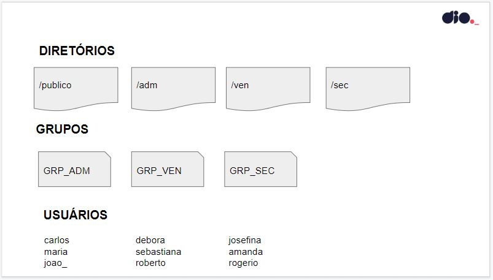

# Modelo de infraestrutura

Infraestrutura de criação de diretórios, usuários e permissões

## Regras

- [x] Excluir diretórios, arquivos, grupos e usuários criados anteriormente;

- [x] Todo provisionamento deve ser feito em um arquivo do tipo Bash Script;

- [x] O dono de todos os diretórios criados será o usuário root;

- [x] Todos os usuários terão permissão total dentro do diretório publico;

- [x] Os usuários de cada grupo terão permissão total dentro de seu respectivo diretório;

- [x] Os usuários não poderão ter permissão de leitura, escrita e execução em diretórios de departamentos que eles não pertencem;

- [x] Subir arquivo de script criado para a sua conta no GitHub.

## Passo a passo definido para execução do script

- [x] Criar estrutura de pastas
- [x] Criar grupos
- [x] Criar permissões dos grupos
- [x] Criar usuários
- [x] Testar permissões dos usuários
- [x] <b>Bônus:</b> Deletar estrutura
